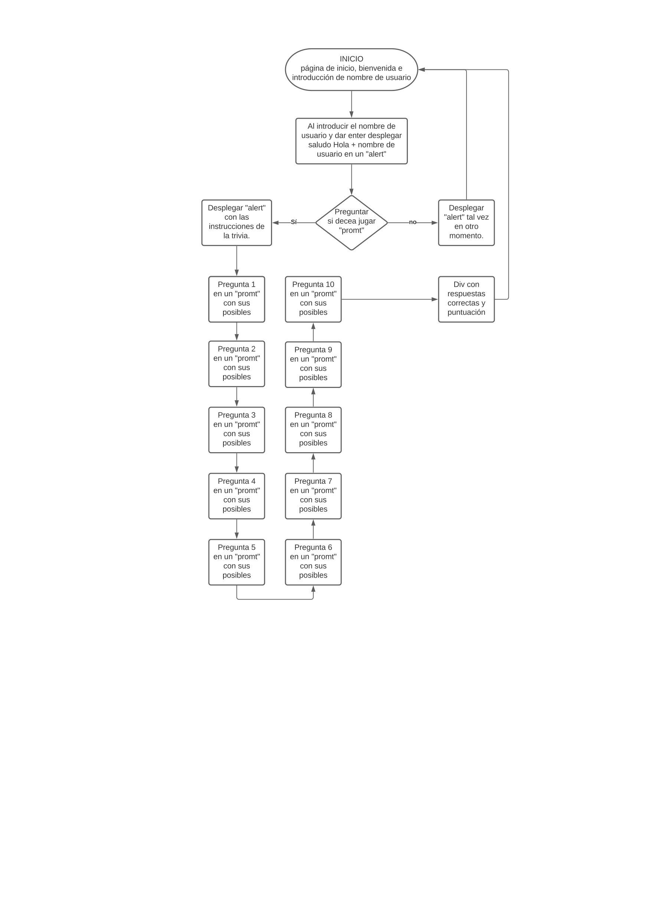

# Proyecto-Trivia 2.0
## Segunda versión de la trivia interactiva 2021 los
En esta trivia se utilizó una nueva forma de hacer las preguntas en "promt" con JavaScript, esta versión permite manejar preguntas t respuestas en una familia de preguntas.
'  var preguntas = [

    {
    prompt: 'En el sexenio de qué presidente se presenta el Movimiento Estudiantil de 1968, que culminó con la sangrienta matanza en la Plaza de las 3 Culturas\n (a) Carlos Salinas de Gortari\n (b) Gustavo Díaz Ordaz\n (c) Vicente Fox Quesada\n',
    answer: "b" 
    },'
---
La Trivia se basa en la información obtenida del libro >"¿Cuando se empezó a xoder Méjico?", de Eduardo García del Río (RIUS) Ed. Grijalbo 2015 México. La cual trata de revivir la memória historica de la población acerca de los peores actos de corrupción de los ]]**"Peores Presidentes que ha tenido México"**. 

